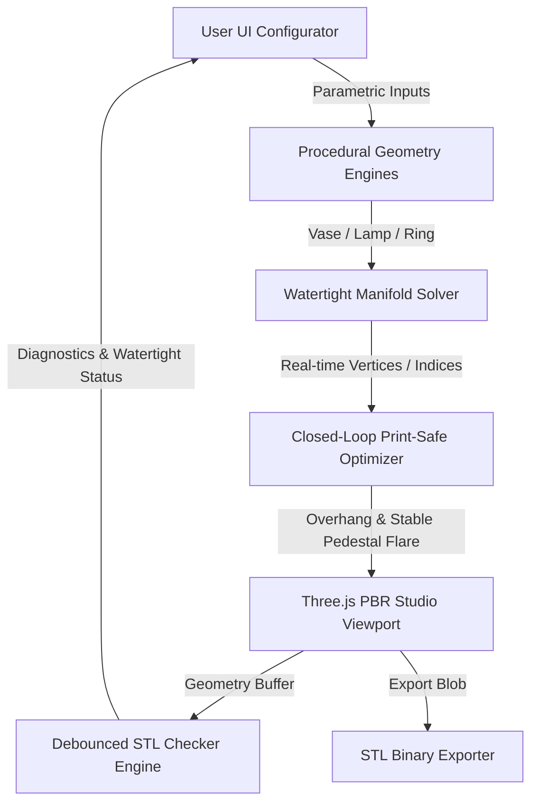

# 3AID: Advanced 3D Additive Intelligence Design ⚡

[](https://opensource.org/licenses/MIT)
[]()
[]()
[]()

> **An open-source, real-time parametric generative CAD studio for functional 3D-printable models. Designed for high-performance digital fabrication, additive manufacturing, and support-free toolpathing.**

---

## 🌐 Overview & Philosophy

**3AID** is an advanced open-source parametric configurator and generative design portal tailored for additive manufacturing (3D printing). By uniting mathematical geometry generation, real-time solid manifold solving, and an embedded closed-loop **Print-Safe CAD Optimizer**, 3AID allows designers, engineers, and makers to generate functional, print-ready, high-fidelity digital models with **0.0% support structure requirements**.

Rather than relying on post-process slicing analysis or mesh repair tools, 3AID implements **correct-by-construction geometry generation**. It ensures every exported file is mathematically watertight, solid-manifold, and perfectly optimized for standard FDM, SLA, or casting processes right out of the box.

We warmly welcome contributions from the community to push the boundaries of procedural design, generative aesthetics, and digital fabrication algorithms!

---

## ⚡ Core Pillars & Architecture



### 1. Multi-Category Parametric Engines
*   **Homeware (Wave Vases)**: Swept vector profile curves (*classic*, *flare*, *hourglass*, *modern*) combined with helical twists, dynamic radial sizing, and structural cutout lattices.
*   **Lighting (Accordion Lamp Shades)**: Dynamic accordion pleating, bridged slot cutout bands, and custom internal point-lights projecting procedural shadows in the viewport.
*   **Jewelry (Princess Rings)**: Custom torus band sweep profiles (*domed*, *flat*, *comfort*, *wavy*, *faceted*), gemstone prong claws, and casting detail guards.

### 2. Embedded Closed-Loop Print-Safe CAD Optimizer
Based on contemporary additive manufacturing literature, the optimizer inspects and adapts coordinates dynamically *during* the generation phase:
*   **45° Overhang Slope Filter**: Restricts the rate of change of radii along the vertical sweep: 
    $$\left| R(y) - R(y - dy) \right| \le dy \cdot 0.90$$
    This locks the overhang angle under $42^\circ$, ensuring flawless **support-free FDM/SLA printing**.
*   **Stability Pedestal Brim**: Automatically detects unstable tall prints (aspect ratio $R_{base} / H < 0.25$) and blends a flared foot pedestal into the bottom 12% of the height:
    $$R_{\text{optimized}}(y) = R(y) + (0.25 \cdot H - R_{base}) \cdot \left(1.0 - \frac{y}{0.12 \cdot H}\right)^2$$
*   **Wall Thickness Nozzle Clamping**: Clamps wall thickness to a minimum of $1.2$ mm and rounds to exact multiples of a $0.4$ mm nozzle, ensuring clean, solid toolpaths without internal voids.

### 3. Real-Time STL Checker & Diagnostics
*   **Asynchronous Watertight Solver**: Uses a debounced boundary edge detector (120ms) to check for non-manifold edges, invalid normals, and open boundaries at a smooth 60 FPS.
*   **Volume & Weight Translations**: Computes precise model volume in $\text{mm}^3$ and automatically calculates the active metal weight for Yellow Gold 18K, Rose Gold 18K, and Platinum 950.

### 4. Multi-LOD Mesh Resolution Selector
Allows the user to scale detail density depending on viewport requirements:
*   **Draft (Fast)**: Highly fluid, low-polygon layout for fast exploratory drags.
*   **Standard (Balanced)**: The optimal default balance of detail and speed.
*   **High / Ultra (Print-Ready)**: Maximizes grid subdivisions (up to 144 radial and 160 height segments) to completely eliminate polygonal stepping and export perfectly smooth, watertight surfaces.

---

## 🛠️ Technology Stack

*   **Core**: HTML5, TypeScript, ES6 Modules.
*   **3D Rendering Engine**: Three.js (WebGL PBR Specular-Glossiness workflow).
*   **Frontend Framework**: React 18, Vite.
*   **Styling**: Vanilla glassmorphism CSS, Lucide icons.
*   **Build Tooling**: Vite for fast hot module replacement (HMR), TypeScript compiler (`tsc`).

---

## 🚀 Getting Started

### Prerequisites
Make sure you have [Node.js](https://nodejs.org/) (v16+) installed.

### Installation
1. Clone the repository:
   ```bash
   git clone https://github.com/3esign/3AID.git
   cd 3AID
   ```
2. Install dependencies:
   ```bash
   npm install
   ```
3. Start the local development server with HMR:
   ```bash
   npm run dev
   ```
4. Build the optimized production bundle:
   ```bash
   npm run build
   ```

---

## 🤝 Contributing & Community

3AID is built on the belief that **generative, mathematically-defined CAD** is the future of additive manufacturing and digital fabrication. By generating meshes directly from parametric equations, we bypass the heavy file sizes, non-manifold errors, and design limitations of traditional CSG CAD editors.

We welcome contributions of all forms:
*   **New Parametric Categories**: Adding procedural templates (e.g. customized planters, gear boxes, textures).
*   **Advanced Geometric Solvers**: Implementing gyroid infills, organic generative branching, or stress-analysis solvers.
*   **UX/UI Enhancements**: Adding advanced viewport analysis overlays, slicing previews, or interactive shader grids.

Please fork the repository, create a descriptive branch, and submit your pull request!

---

## 📜 License

This project is licensed under the **MIT License** - see the [LICENSE](LICENSE) file for details. Let's push digital fabrication forward, together! 🌐
